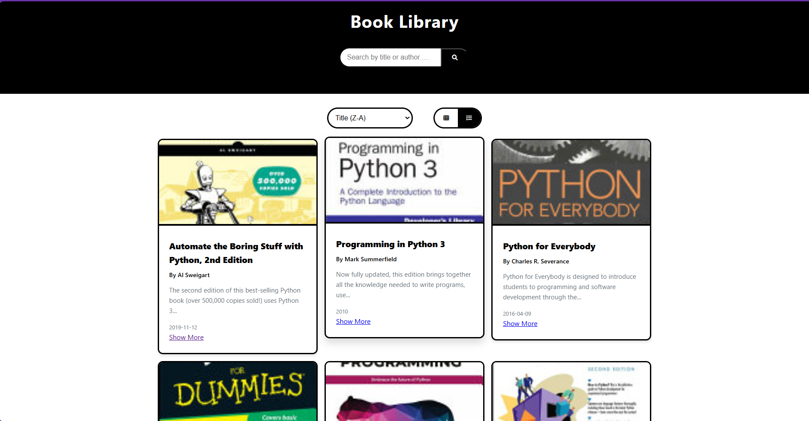
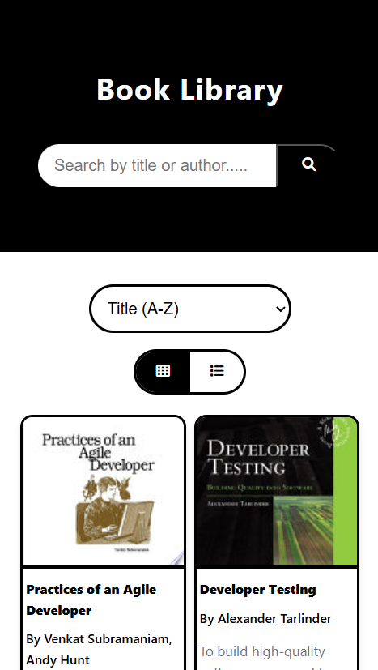
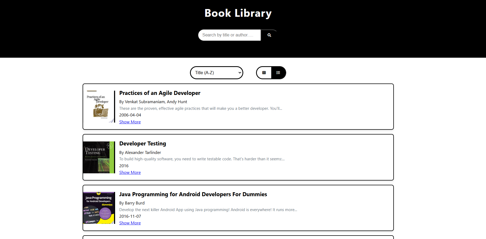
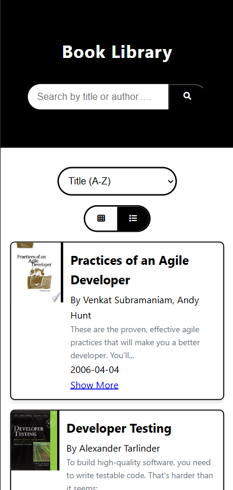

# Book Library by piyush

Crafted by Piyush, the MasterJi Book Library is a sleek, lightweight, and fully responsive web application designed for book lovers. Whether you're searching for your next favorite book or exploring new genres, this dynamic library offers an intuitive and engaging browsing experience.

---

## Table of Contents

- [Features](#features)
- [Screenshots](#screenshots)
- [Live Demo](#live-demo)
- [Tech Stack](#tech-stack)
- [Installation](#installation)
- [Usage](#usage)
- [Contributing](#contributing)
- [License](#license)
- [Contact](#contact)

---

## 🌟 Features

### 🔍 Smart Search & Filtering

- Instant search by title, author, or keywords
- Advanced sorting options:
  - Title (A-Z/Z-A)
  - Publication date (Newest/Oldest)

### 📱 Responsive Design

- Fully responsive layout for all devices
- Toggle between Grid and List view
- Clean, modern UI with Font Awesome icons

### 📖 Book Display

- Detailed book information:
  - Cover image
  - Title, author, publisher
  - Publication date
- Pagination support
- External links to full book details

## 🛠️ Technologies Used

- **Frontend**: HTML5, CSS3, JavaScript(vanilla) (ES6+)
- **API**: [FreeAPI.app Books API](https://api.freeapi.app/api/v1/public/books)
- **Icons**: Font Awesome
- **Responsive Design**: Flexbox, CSS Grid

---

## Screenshots

### Grid Layout

<table>
  <tr>
    <td></td>
    <td></td>
  </tr>
  <tr>
    <td align="center"><b>Desktop View</b></td>
    <td align="center"><b>Mobile View</b></td>
  </tr>
</table>

### List Layout

<table>
  <tr>
    <td></td>
    <td></td>
  </tr>
  <tr>
    <td align="center"><b>Desktop View</b></td>
    <td align="center"><b>Mobile View</b></td>
  </tr>
</table>

---

## Live Demo

Check out the app live version:  
[MasterJi Book Library Live Demo](https://booklibrarychaicode.netlify.app)

---

## Tech Stack

- **HTML5 & CSS3:** For structuring and styling the web pages.
- **JavaScript (ES6 Modules):** modern syntax.  (vanilla)
- **Font Awesome:** For incorporating stylish icons.
- **api:** freeapi for data

---

## Installation

Follow these steps to run the project locally:

1. **Clone the repository:**
   ```bash
   git clone https://github.com/piyush8512/cohort_code/tree/main/cohort_code/assignment/assign-4.git
   ```

## Usage

1. Open the application in your browser.
2. Use the search bar to find books.
3. Toggle between grid and list views.
4. Sort books by title or publication date.
5. Navigate between pages using pagination controls.

---

## Contributing

Contributions are welcome! If you'd like to improve this project, follow these steps:

1. **Fork the repository**
2. **Create a new branch** (`feature-branch`)
3. **Commit your changes**
4. **Push to GitHub**
5. **Submit a Pull Request**

---

## Owner

Piyush
thanku  
