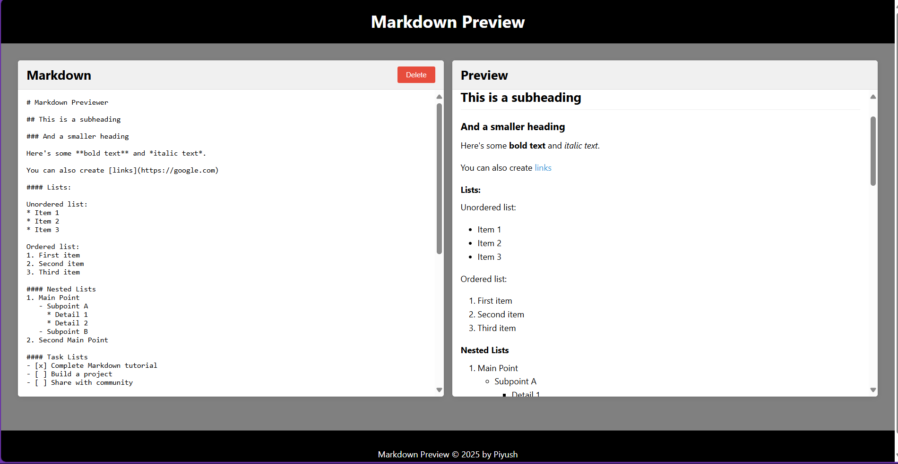
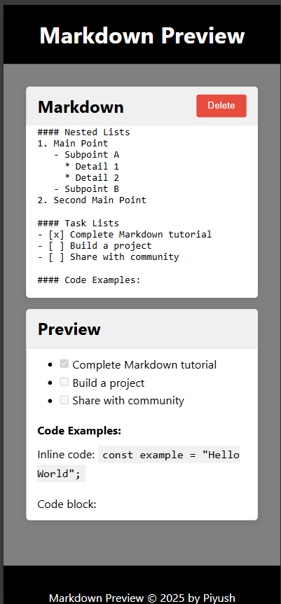

# Markdown Previewer

A simple, real-time Markdown previewer that allows users to input Markdown syntax and instantly see the formatted output.

## Features

1. **Real-time Preview**: See your Markdown rendered instantly as you type
2. **Split View Layout**: Editor on the left, preview on the right
3. **Syntax Support**: 
   - Headings (# H1, ## H2, etc.)
   - Text formatting (bold, italic)
   - Links
   - Lists (ordered and unordered)
   - Code blocks (inline and multi-line)
   - Blockquotes
   - Images
4. **Code Highlighting**: Syntax highlighting for code blocks
5. **Clear Button**: Reset the editor with a single click
6. **Responsive Design**: Works on both desktop and mobile devices

## Screenshots




## Live Demo

[View Live Demo]()

## Technologies Used

- HTML5
- CSS3
- JavaScript (vanilla)
- [Marked.js](https://marked.js.org/) - Markdown parser and compiler
- [Highlight.js](https://highlightjs.org/) - Syntax highlighting for code blocks
- [GitHub Markdown CSS](https://cdnjs.cloudflare.com/ajax/libs/highlight.js/11.7.0/styles/github.min.css) - Styling for code blocks


## Installation and Setup

1. Clone the repository:
   ```
   git clone 
   ```

2. Open `index.html` in your browser

## How to Use

1. Type or paste Markdown in the left panel
2. View the rendered HTML in the right panel
3. Use the Clear button to reset the editor

## Development

This project is built with vanilla JavaScript without any build tools or bundlers, making it easy to modify and extend:

- `index.html` - Basic structure of the application
- `styles.css` - All styling and responsive design
- `script.js` - Application logic and Markdown processing


## Acknowledgements

- [Marked.js](https://marked.js.org/) for the Markdown parsing functionality
- [Highlight.js](https://highlightjs.org/) for code syntax highlighting

